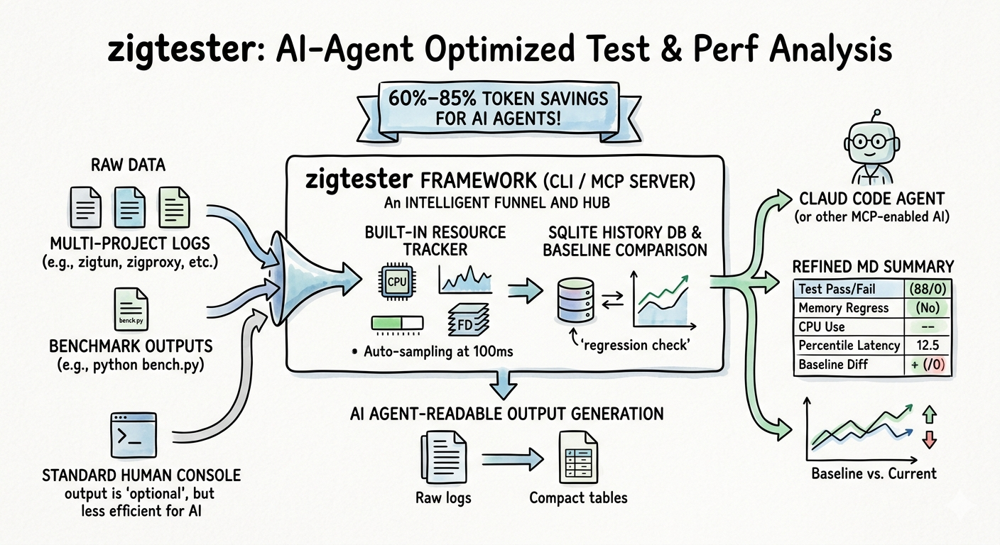

# zigtester



**One config file. All your tests. Measured 60%–85% token reduction for AI agent testing, with dramatically improved tool-use accuracy and efficiency.** zigtester is a language-agnostic unified test framework — drop a `zigtester.yaml` into any project and get consistent discovery, execution, reporting, and historical regression tracking. It's a CLI tool. It's also an AI agent's test execution engine.

[](https://opensource.org/licenses/MIT)

## Why zigtester

Maintaining multiple independent projects means each one tends to grow its own test tools, output formats, and run conventions. Switching between projects means remembering different commands, parsing different output, and manually comparing historical data — that's not how testing should feel.

- **One config, zero fragmentation** — drop a `zigtester.yaml` in any project and the framework takes care of discovery, execution, and reporting
- **Wraps existing tests, doesn't replace them** — works with what you already have (`zig build test`, Python scripts, shell commands)
- **Resource monitoring by default** — CPU, memory, and file descriptors tracked on every run, no per-project instrumentation needed
- **Performance regressions don't go unnoticed** — every run is automatically compared against historical baselines, anomalies flagged on sight
- **AI-native integration** — MCP Server lets your AI coding agent execute tests, analyze results, and flag regressions in real time

## AI Agent-Driven Daily Testing

zigtester's biggest value proposition: **you no longer need to run tests, read output, or compare history yourself**. Hand execution and initial analysis to the AI agent — you focus on the conclusions it reports.

Having AI read raw test output is expensive: it burns tokens, misparses formats, and misses critical signals. zigtester parses everything server-side and returns only structured summaries — a 500-line `zig build test` output becomes `{passed: 88, failed: 0, skipped: 1}`, 100 rounds of benchmark data are distilled into percentile summaries. The AI spends tokens on judgment and recommendations, not on deciphering output.

### "I just changed X — does it still work?"

```
You: I just changed the SS2022 cipher in zigoutbounds. Run the relevant tests.

AI agent via MCP:
  → zigtester_list zigoutbounds          # what suites are available?
  → zigtester_run zigoutbounds --suite e2e-ss2022  # auto-includes dependency crypto-ss2022
  → Returns: 2/2 passed, 0.8s, peak memory 34 MB

What you see:
  "SS2022 cipher tests all pass. No regressions."
```

### Pre-PR health check across the board

```
You: About to open a PR. Run unit tests for every project — make sure I didn't break anything.

AI agent via MCP:
  → zigtester_run --all --level unit
  → 6 projects in parallel, 5 seconds total
  → Structured summary returned (not hundreds of lines of raw zig build test output per project)

What you see:
  "6/6 projects pass: zigfoundation (88 pass), zigtun (3 pass),
   zigproxy (5 pass), zigdns (12 pass), zigoutbounds (15 pass), zigbox (23 pass)"
```

### "Did my change hurt performance?"

```
You: Did this change affect zigbox throughput?

AI agent via MCP:
  → zigtester_history zigbox bench-throughput
  → Loads last 10 runs, compares against baseline automatically

What you see:
  "bench-throughput: 2180 req/s current vs 2160 req/s baseline (+0.9%). No regression.
   Resources: memory 45 MB (baseline 42 MB, +7%), FD 18 (baseline 16, +12%).
   Within safe range."
```

### CI is red — let AI triage

```
You: GitHub Actions shows zigoutbounds functional is red. Figure out what's going on.

AI agent via MCP:
  → zigtester_run zigoutbounds --level functional
  → Finds e2e-vless-udp failed, exit code 1
  → Checks history: this suite was PASS yesterday, resource usage unchanged

What you see:
  "e2e-vless-udp failed — first failure in the last 10 runs.
   Last pass was yesterday 18:30. Check today's VLESS UDP wire format changes."
```

### Move a project, keep its history

```
You: I moved zigoutbounds from ~/old-path/ to ~/new-path/. Is its history gone?

AI agent via MCP:
  → zigtester run detects UUID match, history carries over seamlessly

What you see:
  "History is intact. zigtester identifies projects by UUID, not directory path.
   Moving directories doesn't affect history."
```

## Core Capabilities

### Four-level test model

| Level | Focus | Typical use |
|-------|-------|-------------|
| **unit** | Pure code correctness | `zig build test`, no network dependencies |
| **functional** | Protocol & integration | Multi-protocol interop, end-to-end validation |
| **performance** | Throughput & latency | Benchmarks, threshold checks, regression detection |
| **stress** | Stability under load | High concurrency, resource limit monitoring, long-running |

### Built-in resource monitoring

CPU, memory, and file descriptor usage are automatically sampled on every test run and displayed directly in the report. No per-project instrumentation needed. Resource metrics are also covered by regression detection: a 30% memory increase or a 50% FD leak gets flagged against historical baselines automatically.

### Plugins as test dependencies

echo server, sing-box, xray-core — test dependencies declare their lifecycle in a `plugin.yaml`. Projects opt in with a single `plugins:` line. zigtester handles build, startup, readiness probes, teardown, and cleanup, with automatic port conflict detection.

## Quick Start

```bash
# Install
git clone https://github.com/fixnet-ai/zigtester
cd zigtester
python3 -m venv .venv && source .venv/bin/activate
pip install -e .

# Generate a config for your project
zigtester init --dir ../myproject --project myproject

# Edit the generated zigtester.yaml, then run
zigtester run myproject
```

zigtester also works as a classic CLI for terminals and CI pipelines:

```bash
zigtester scan                          # discover all instrumented projects
zigtester run zigoutbounds              # run all levels
zigtester run --all --level unit        # unit tests across every project
zigtester history zigoutbounds bench    # check performance history
```

Example config (full reference in [DESIGN.md](./DESIGN.md)):

```yaml
project: myproject
description: "A short description"

settings:
  build_command: "zig build"
  timeout_default: 120

plugins:
  - local-echo

levels:
  unit:
    - name: "all-tests"
      command: "zig build test"
      parser: zig_test
  performance:
    - name: "bench"
      command: "python3 tests/bench.py"
      parser: bench
      metrics:
        - name: throughput
          pattern: "throughput: ([0-9.]+) req/s"
      thresholds:
        throughput:
          min: 100
```

## MCP Server Deployment

```bash
# Start (long-running daemon; stateless JSON-RPC, no SSE/session overhead)
ZIGTESTER_ROOT=~/projects python -m zigtester.server &

# Any MCP client config (Claude Code, VS Code, etc.):
{
  "zigtester": {
    "type": "http",
    "url": "http://127.0.0.1:9020/mcp"
  }
}
```

The MCP Server exposes 5 tools: `zigtester_scan`, `zigtester_list`, `zigtester_run`, `zigtester_history`, `zigtester_init`. Your AI coding agent calls them automatically — you just describe what you want in natural language.

### Why MCP instead of letting AI read raw output

| AI reads raw output | Via zigtester MCP |
|---------------------|-------------------|
| 500 lines of `zig build test` in context | → `{passed: 88, failed: 0, skipped: 1}` |
| 100 benchmark rounds dumped verbatim | → server-side percentile summary |
| 6 projects: manual `ls` / `read` per project | → one `zigtester_scan` call |
| 30 history records as full text | → trend summary + anomaly markers only |
| AI can misparse output formats | → structured data, 100% reliable |

## Output Formats

One result, three formats, each for a different audience:

| Format | Audience | Characteristic |
|--------|----------|---------------|
| **Terminal** | Human, day-to-day dev | ANSI color, clear hierarchy, resource summary |
| **Markdown** | AI Agent (MCP return) | Compact tables, zero redundancy |
| **JSON** | CI pipelines, programmatic consumers | Full structured data |

## Tech Summary

- **Python 3.10+**, PyYAML + FastMCP
- **SQLite** single-file history store (WAL mode), auto-migrates from legacy JSON
- **Stateless JSON-RPC over HTTP** — no SSE, no sessions; works with any MCP client
- **Port binding** ensures at most one server instance — no zombie processes
- **UUID project identity** — move directories without losing history
- Subprocess isolation with timeout control, graceful signal termination, and residue cleanup
- 5 built-in output parsers, extensible via custom regex patterns

## License

MIT
